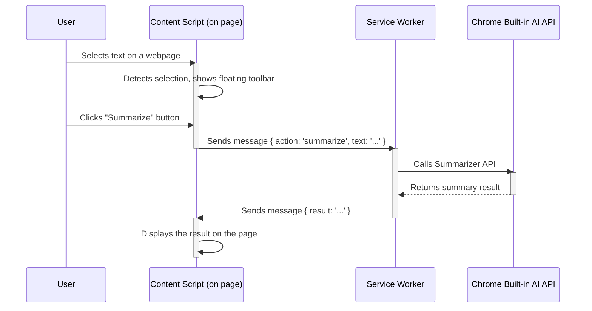

# Sophera AI Assistant 🤖

<p align="center">
  
</p>

<p align="center">
  <strong>Smart text assistant powered by Chrome's built-in AI. Translate, summarize, rewrite and more - all offline and private.</strong>
</p>

## ✨ Key Features

### 🎯 Core AI Functions
- **🌐 AI Translation** - Powered by the Translator API.
- **📝 Smart Summary** - Generate summaries of different types (key points, TL;DR, title).
- **✍️ Rewrite Text** - Improve text clarity and structure using the Prompt API.
- **🤖 Ask AI** - Analyze and answer questions about the selected text.

### 交互界面 (Interfaces)
- **Floating Toolbar** - Appears instantly on text selection for quick actions.
- **Side Panel** - Offers a richer interactive experience and history.

### 🛠️ Advanced Customization
- **Custom Settings** - Adjust summary type, length, and format.
- **Prompt Templates** - Customize templates for rewriting and enhancing text.
- **Toolbar Customization** - Show or hide buttons in the toolbar.
- **Cloud Sync** - All settings are synced across your devices via `chrome.storage.sync`.

## 🚀 Quick Start

1.  **Download the Project**: Clone or download this repository.
    ```bash
    git clone https://github.com/hotylll/Sophera-AI-Assistant.git
    ```
2.  **Enable Chrome AI**:
    - Go to `chrome://flags/#optimization-guide-on-device-model` and set it to `Enabled BypassPerfRequirement`.
    - Go to `chrome://flags/#prompt-api-for-gemini-nano` and set it to `Enabled`.
    - Relaunch Chrome.
3.  **Install the Extension**:
    - Go to `chrome://extensions/`.
    - Enable "Developer mode".
    - Click "Load unpacked" and select the project folder.

➡️ **For a more detailed, step-by-step guide, please see [INSTALL.md](INSTALL.md).**

## 🏗️ Architecture

This extension is built on Manifest V3. Here is the core workflow:



-   **Content Script (`content.js`)**: Listens for text selection, manages the floating toolbar UI, and communicates with the service worker.
-   **Service Worker (`background.js`)**: Acts as the extension's brain, handling requests, calling the appropriate Chrome AI APIs, and returning results.

## 📂 Project Structure

```
sophera-ai-assistant/
├── manifest.json
├── background.js
├── content.js
├── _locales/
├── icons/
├── styles/
└── ui/
```

## 🔧 Tech Stack

- **Manifest V3**
- **Chrome Built-in AI APIs**:
  - [Translator API](https://developer.chrome.com/docs/ai/translator-api)
  - [Summarizer API](https://developer.chrome.com/docs/ai/summarizer-api)
  - [Prompt API](https://developer.chrome.com/docs/ai/prompt-api)
- **Vanilla JavaScript (ES6+)** - No external dependencies.

## 🔒 Privacy

- ✅ **Fully Local**: All AI processing is done on your device.
- ✅ **No Data Upload**: No data is sent to any external servers.
- ✅ **Offline Ready**: Works completely offline after the initial model download.
- ✅ **Open Source**: All code is public and auditable.

## 🛠️ Development

### Local Setup
```bash
# Clone the repository
git clone https://github.com/your-username/your-repository.git
cd your-repository

# Load the extension in Chrome
# Go to chrome://extensions/, enable Developer mode, and "Load unpacked".
```

### Contributing
Contributions are welcome! Please open a pull request.

## 📄 License

MIT License. See the [LICENSE](LICENSE) file for details.

## 📧 Contact

- Report Bugs: [GitHub Issues](https://github.com/hotylll/Sophera-AI-Assistant/issues)
- Feature Suggestions: [GitHub Discussions](https://github.com/hotylll/Sophera-AI-Assistant/discussions)

---

**⭐ If you find this project helpful, please give it a star!**
